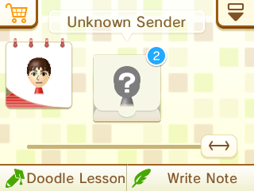

# Swapdoodle Migration Tool

This utility will read your Swapdoodle extdata and assist you in migrating your save data.

[Download it from the Releases page.](https://github.com/SwapdoodleRevival/migration-tool/releases/)

> [!WARNING]
> Currently, this tool **does not back up your extdata** before processing it.
> 
> You are advised to back up your **extdata** (*not* save data!) before using this tool. Checkpoint should be installed on nearly all modded 3DS devices and works best for this task.

## Why is this needed? 

When you use Nimbus and change to your Pretendo account, Swapdoodle will start treating your save data differently. Your notes will be moved to **Unknown Sender**, as shown here:

Every user within the 3DS ecosystem has a unique identifier called a PID. Swapdoodle uses them to attribute your stored notes to your friends in the friends list.

When you switch to Pretendo Network, your friends list is empty, which causes Swapdoodle to stash notes from your friends in the Unknown Sender category. But, even if you re-add your friends on Pretendo Network, their PIDs will be *different* from those they had on Nintendo Network.

This ultimately means that your Swapdoodle notes will no longer be mapped to their sender correctly and thus end up in the **Unknown Sender** category.

The tool will read your extdata and automatically attempt to match your old Nintendo Network Friends to your new Pretendo Network Friends. You will have the option to fine-tune the mapping if needed.

How does it work?

The matcher works with MAC addresses, which are stored in Mii Data. Since Mii Data is available in both the friend list and *every* Swapdoodle note, we can use them to match old <=> new accounts flawlessly.

The only situation where this won't work would be if your friend got themselves a new console, as MAC addresses are per-device.

## Status

This tool has been tested on two different consoles and with a note library at around ~1000 notes, where we've confirmed it to work, and we're confident that it can handle most situations without much trouble.
If you do encounter any issues, though, please let us know!